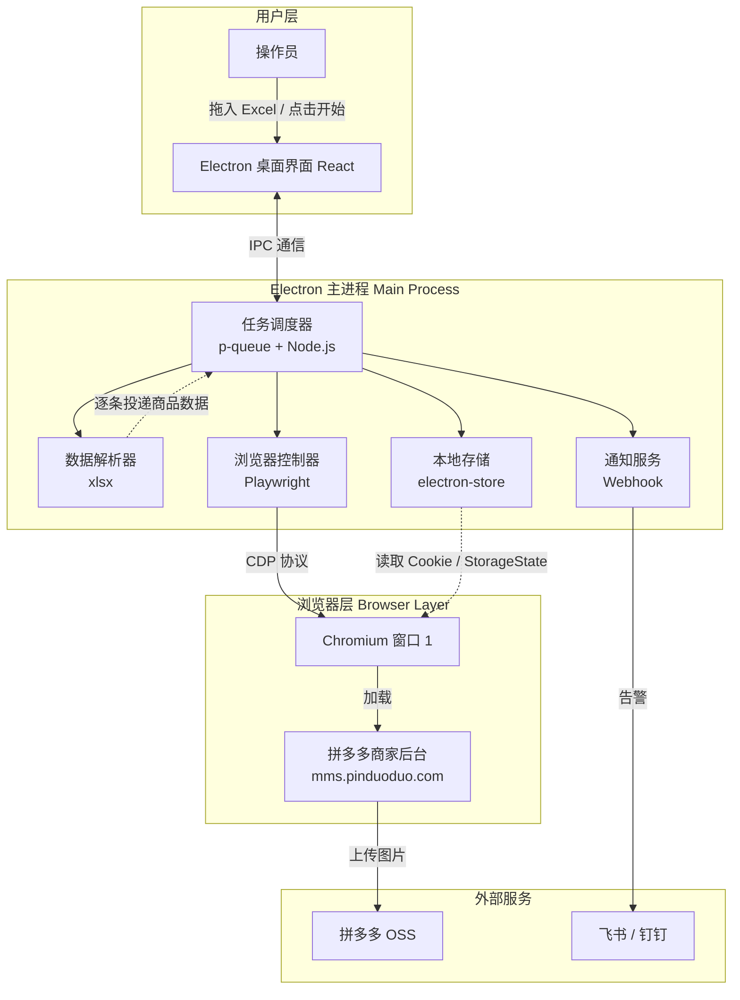
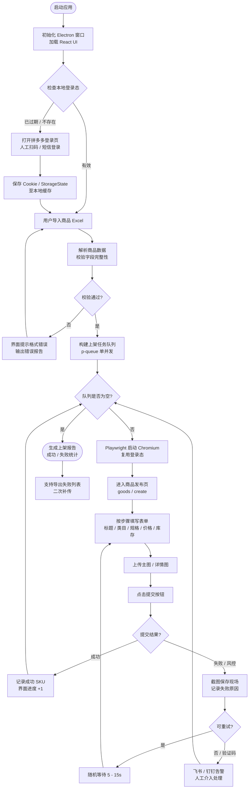
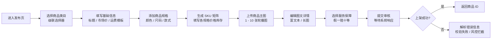
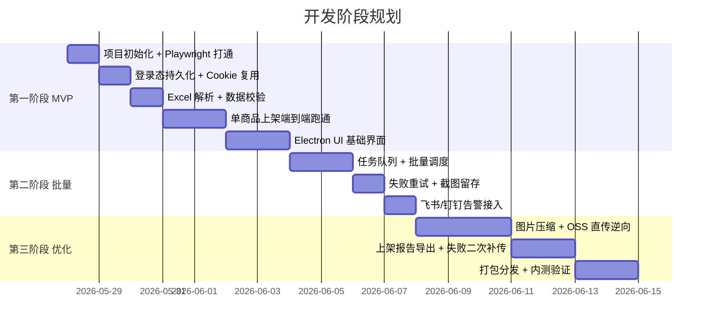

# 拼多多批量上架助手 — 技术方案

> 目标：构建一个基于 Electron + Playwright 的桌面端工具，实现拼多多商家后台商品的自动化批量上架。

---

## 一、项目概述

| 项目         | 说明                                                                           |
| ------------ | ------------------------------------------------------------------------------ |
| **名称**     | 拼多多批量上架助手                                                             |
| **形态**     | 桌面应用程序（macOS `.dmg` / Windows `.exe`）                                  |
| **核心能力** | 读取商品 Excel → 自动登录拼多多商家后台 → 按流程填写表单 → 上传图片 → 提交上架 |
| **运行模式** | 单账号串行执行（规避平台风控）                                                 |
| **用户群体** | 运营人员，无需技术背景即可操作                                                 |

---

## 二、技术栈选型

| 层级           | 技术/工具              | 作用说明                                       |
| -------------- | ---------------------- | ---------------------------------------------- |
| **桌面壳**     | Electron               | 窗口管理、系统托盘、菜单栏、打包分发           |
| **浏览器控制** | Playwright             | 启动/控制 Chromium，模拟点击、填表、上传、截图 |
| **开发语言**   | TypeScript             | 主进程 + 渲染进程统一 TS，类型安全             |
| **构建工具**   | Vite + `electron-vite` | 快速打包、热更新、产物优化                     |
| **前端 UI**    | React 18 + Semi Design | 渲染进程界面：导入、进度、日志、配置           |
| **数据解析**   | `xlsx`                 | 解析 Excel 商品源文件                          |
| **任务调度**   | Node.js + `p-queue`    | 批量队列、串行执行、失败重试                   |
| **状态存储**   | `electron-store`       | 本地保存登录态 Cookie、用户配置、任务历史      |
| **进程通信**   | Electron IPC           | 主进程（调度/浏览器控制）↔ 渲染进程（UI）      |
| **异常告警**   | 飞书/钉钉 Webhook      | 验证码拦截、连续失败时通知人工介入             |
| **打包发布**   | `electron-builder`     | 输出 `.dmg` / `.exe` / `.zip`                  |

---

## 三、系统架构



---

## 四、核心流程

### 4.1 批量上架主流程



### 4.2 单商品上架步骤拆解



---

## 五、数据结构设计（Excel 导入模板）

### 5.1 单 Sheet 结构

| 字段名            | 类型   | 必填 | 说明                             |
| ----------------- | ------ | ---- | -------------------------------- |
| `title`           | string | ✅   | 商品标题（≤60字符）              |
| `categoryPath`    | string | ✅   | 类目路径，如 `数码配件>手机壳`   |
| `marketPrice`     | number | ✅   | 市场价（元）                     |
| `groupPrice`      | number | ✅   | 拼单价（元）                     |
| `singlePrice`     | number | ❌   | 单买价（元），默认同拼单价       |
| `stock`           | number | ✅   | 库存数量                         |
| `outerId`         | string | ❌   | 商家编码（SKU级）                |
| `spec1Name`       | string | ❌   | 规格1名称，如 `颜色`             |
| `spec1Value`      | string | ❌   | 规格1值，如 `红色`               |
| `spec2Name`       | string | ❌   | 规格2名称，如 `尺码`             |
| `spec2Value`      | string | ❌   | 规格2值，如 `XL`                 |
| `mainImages`      | string | ✅   | 主图本地路径，分号分隔，最多10张 |
| `detailHtml`      | string | ❌   | 详情页 HTML 或图片路径           |
| `freightTemplate` | string | ✅   | 运费模板名称（需提前在后台创建） |
| `returnPolicy`    | string | ❌   | 退货承诺，如 `7天无理由`         |

### 5.2 多规格商品行展开示例

| title            | spec1Name | spec1Value | spec2Name | spec2Value | groupPrice | stock |
| ---------------- | --------- | ---------- | --------- | ---------- | ---------- | ----- |
| iPhone 15 手机壳 | 颜色      | 红色       | 型号      | 标准版     | 19.9       | 100   |
| iPhone 15 手机壳 | 颜色      | 红色       | 型号      | 防摔版     | 29.9       | 80    |
| iPhone 15 手机壳 | 颜色      | 蓝色       | 型号      | 标准版     | 19.9       | 120   |

> 同一 `title` + `categoryPath` 的行会被合并为同一个商品的不同 SKU。

---

## 六、项目目录结构

```
pdd-uploader/
├── release/                        # 打包产物
│   ├── mac/                        # macOS .dmg
│   └── win/                        # Windows .exe
├── resources/
│   └── template.xlsx               # 商品导入模板
├── src/
│   ├── main/                       # Electron 主进程（Node.js）
│   │   ├── index.ts                # 主进程入口
│   │   ├── browser/                # Playwright 浏览器控制
│   │   │   ├── controller.ts       # 浏览器生命周期管理
│   │   │   └── actions/            # 拼多多页面操作原子能力
│   │   │       ├── login.ts
│   │   │       ├── publish.ts
│   │   │       └── upload.ts
│   │   ├── scheduler/              # 任务调度
│   │   │   ├── queue.ts            # p-queue 封装
│   │   │   └── runner.ts           # 单商品上架执行器
│   │   ├── parser/                 # 数据解析
│   │   │   └── excel.ts            # xlsx 读取与校验
│   │   ├── store/                  # 本地存储
│   │   │   └── config.ts           # electron-store 封装
│   │   └── notify/                 # 通知服务
│   │       └── webhook.ts          # 飞书/钉钉消息推送
│   ├── preload/                    # 预加载脚本（IPC 桥接）
│   │   └── index.ts
│   └── renderer/                   # 渲染进程（React）
│       ├── main.tsx                # 渲染进程入口
│       ├── App.tsx                 # 根组件
│       ├── pages/
│       │   ├── Dashboard/          # 主控台：导入/开始/进度
│       │   ├── Settings/           # 配置页：登录/告警/模板下载
│       │   └── Logs/               # 执行日志与报告
│       └── components/
│           ├── ExcelUploader.tsx
│           ├── ProgressBar.tsx
│           └── LogViewer.tsx
├── electron.vite.config.ts         # 构建配置
├── electron-builder.yml            # 打包配置
├── package.json
└── tsconfig.json
```

---

## 七、关键设计决策

| 决策点           | 选择                              | 理由                                                               |
| ---------------- | --------------------------------- | ------------------------------------------------------------------ |
| **浏览器控制**   | Playwright                        | 自动等待机制成熟、文件上传 API 稳定、Trace 调试友好                |
| **并发策略**     | 单账号单并发                      | 拼多多风控严格，多开易触发滑块验证或账号限流                       |
| **登录态持久化** | `storageState` + `electron-store` | Playwright 原生支持 Cookie / LocalStorage 的保存与复用             |
| **图片上传**     | 优先 UI 模拟，后续逆向 OSS 直传   | 初期用 Playwright `setInputFiles` 稳定实现；长期抓包走直传接口提速 |
| **进程通信模式** | Electron IPC + 预加载脚本         | 安全隔离渲染进程与主进程，符合 Electron 安全最佳实践               |
| **UI 框架**      | Semi Design                       | 字节内部设计系统，组件丰富、支持暗色模式、与 React 18 兼容         |
| **异常处理**     | 截图 + 3 次重试 + 人工告警        | 失败保留现场，连续失败不盲目重试，及时通知人工                     |

---

## 八、风险与规避策略

| 风险点            | 影响           | 规避策略                                                   |
| ----------------- | -------------- | ---------------------------------------------------------- |
| **登录态过期**    | 流程中断       | 启动时检测有效期，过期前自动提醒；扫码登录后持久化 Cookie  |
| **滑块 / 验证码** | 阻断自动化     | Playwright 暂停，截图通知飞书/钉钉，等待人工处理完成后恢复 |
| **类目调整**      | 选择器失效     | 类目路径使用文本匹配兜底，减少纯 CSS 选择器依赖            |
| **页面结构改版**  | 脚本大面积失效 | 操作原子化封装（actions/），失效时只需修改局部定位器       |
| **图片上传超时**  | 单商品失败     | 大图预先压缩，设置 60s 上传超时，失败计入重试队列          |
| **账号风控封禁**  | 业务停摆       | 控制上架频率（单商品间隔 ≥ 5s），避免夜间高频操作          |
| **SKU 组合过多**  | 表单渲染慢     | 超过 20 个 SKU 时分批填写，或评估是否需要简化规格          |

---

## 九、演进路线图



| 阶段     | 目标           | 验收标准                                              |
| -------- | -------------- | ----------------------------------------------------- |
| **MVP**  | 单商品自动上架 | 输入一个商品 Excel 行，自动完成上架并返回商品ID       |
| **批量** | 队列化批量执行 | 支持50个商品串行上架，失败可重试，异常可告警          |
| **优化** | 提速与稳定     | 图片上传走直传接口，整体上架耗时减少50%，支持报告导出 |
| **长期** | 多平台扩展     | 抽象通用上架引擎，复用至淘宝/抖音/京东后台            |

---

## 十、交付物清单

| 交付物                           | 形态           | 用途                     |
| -------------------------------- | -------------- | ------------------------ |
| `拼多多上架助手-1.0.0.dmg`       | macOS 安装包   | 运营人员本地安装运行     |
| `拼多多上架助手 Setup 1.0.0.exe` | Windows 安装包 | 同上                     |
| `template.xlsx`                  | Excel 模板     | 商品数据录入规范         |
| 使用说明书                       | PDF / 飞书文档 | 首次登录、导入、常见问题 |
| 源码仓库                         | Git            | 后续迭代维护             |

---

## 附录：Playwright 与 Electron 的关系澄清

**问：Node.js 能操作浏览器吗？**

答：Node.js 本身不能直接操作浏览器，但 Playwright 是一个 Node.js 库，它会自动下载 Chromium 浏览器，并通过 **Chrome DevTools Protocol (CDP)** 与其通信。因此，你写的是 `.ts` 文件，跑在 Node.js 里，实际在控制一个真实的浏览器窗口。

Electron 更进一步：它把 Chromium 和 Node.js 打包在一起，形成一个桌面应用。Playwright 可以连接并控制 Electron 的 BrowserWindow，也可以独立启动 Chromium 实例。

在本方案中，Electron 负责 UI 外壳，Playwright 负责浏览器控制，两者通过 IPC 协作。
